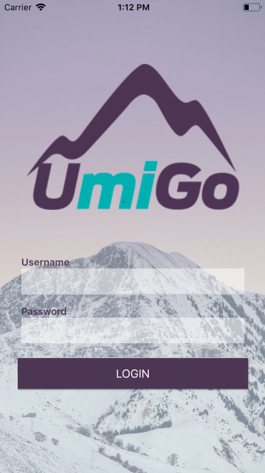
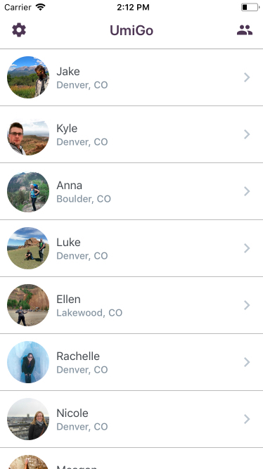
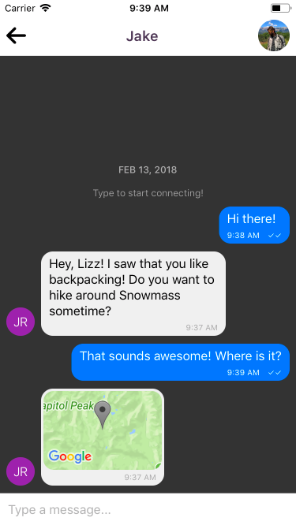

# UmiGo

A mobile social networking app that connects outdoor enthusiasts

Technologies used: React Native, Express, Node.js, Knex.js, PostgreSQL

## Instructions

#### To run locally:
- Fork and clone the repo
- In command line, `git clone {insert-your-repo-SSH-key}`
- Run `npm install`
- Run `npm run ios`

#### To contribute:
- When ready to contribute to the project, issue a new pull request from your repo with a detailed explanation of what and why
